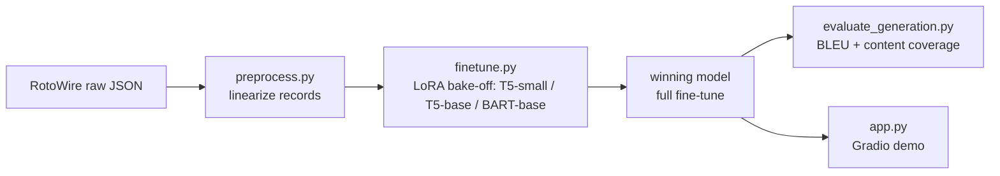

# NBA Box-Score Recap Generator

A data-to-text NLP project: fine-tune an encoder-decoder Transformer to turn
a structured NBA box score into a natural-language game recap, using the
[RotoWire](https://github.com/harvardnlp/boxscore-data) dataset.

## Problem

A box score is a table of facts — points, rebounds, assists, team totals.
A recap is a short article that decides which of those facts are worth
mentioning, in what order, and how to phrase them. This project asks: can a
small, LoRA-fine-tuned encoder-decoder model learn that mapping well enough
to write a readable, factually grounded recap on its own?

Unlike a pure "commentate every event" approach, RotoWire's recaps already
demonstrate real editorial content selection (a human decided which stats
mattered) — so instead of hand-coding selection rules, this project lets the
model learn content selection from ~4,850 real (box score, recap) pairs.

## Data source

[RotoWire](https://github.com/harvardnlp/boxscore-data) (Wiseman, Shieber,
Rush — EMNLP 2017): NBA games from 2014-01-01 to 2017-03-29, each paired
with a human-written recap. Free, widely used as a data-to-text NLG
benchmark — cite the original paper if this repo is used further.

For applying the fine-tuned model beyond the dataset's 2017 cutoff,
[nba_api](https://github.com/swar/nba_api) (MIT license, no key required,
pulls from NBA.com's own stats API) can supply recent/live box scores — see
"Known limitations" below for the schema-mapping work that implies.

## Architecture

- **Preprocessing** (`src/preprocess.py`): linearizes each game's
  `home_line`/`vis_line`/`box_score` into a flat sequence of
  `<record> entity | stat | value | HOME|VIS </record>` spans — the
  standard record representation from the data-to-text literature — paired
  with the detokenized human recap as the generation target.
- **Model bake-off, not a theoretical pick** (`src/finetune.py`): T5-small,
  T5-base, and BART-base are each LoRA-fine-tuned on the same small subset
  of examples; the winner (by fluency, factual grounding, and variety of
  phrasing) gets the full training run. LoRA keeps this feasible on a free
  Colab T4: only small adapter matrices are trained, checkpoints are a few
  MB, cheap to save across session disconnects.
- **Generation with real variety**: sampling (temperature + top-p, multiple
  `num_return_sequences`) rather than greedy/beam decoding — a deterministic
  decode gives near-identical phrasing for similar stat lines every time.
- **Evaluation** (`src/evaluate_generation.py`): BLEU (surface form) plus an
  approximate content-coverage score — deliberately *not* claimed to be the
  original paper's Relation Generation / Content Selection / Content
  Ordering metrics, which require a separately trained information-extraction
  model to re-derive records from generated text. See the module docstring
  for the honest scoping note on this trade-off.
- **Demo** (`src/app.py`): a Gradio app — pick a held-out test game, see the
  linearized input, generate one or more candidate recaps, compare against
  the real human summary. Deployable as-is to a free Hugging Face Space.

### Pipeline



## Known limitations

- **Content-selection/ordering metrics are approximate, not the paper's
  RG/CS/CO.** Reimplementing those faithfully means training a separate
  information-extraction model on this same data — scoped out for now, see
  `src/evaluate_generation.py`'s docstring. BLEU comparisons to published
  numbers are like-for-like; the content-coverage number is this project's
  own proxy and shouldn't be read as equivalent to CS.
- **The dataset stops in March 2017.** Applying the model to current games
  needs `nba_api` plus a schema-normalization step (its box-score format
  doesn't match RotoWire's field names one-for-one) — not yet built.
- **English only.** An earlier iteration of this project targeted French
  football commentary (StatsBomb data); it was set aside in favor of
  RotoWire specifically to front-load the NLP work over building a training
  set from scratch. See project notes for the reasoning trail.
- **The preprocessing schema was verified against the bilingual GEM
  re-packaging of RotoWire, not byte-for-byte against the original
  `rotowire/train.json`** (which ships as a `.tar.bz2`, not a browsable raw
  file). `preprocess.py` is schema-driven (reads whatever stat keys are
  actually present) specifically to be robust to any small difference —
  but sanity-check one real record by hand the first time you run it.

## Possible next steps

- Train a proper RG/CS/CO information-extraction model to get a real,
  literature-comparable evaluation rather than the current approximation.
- Extend the LoRA quality/faithfulness filter: an encoder-only classifier
  (fine-tuned to spot generated text that contradicts the box score) used
  to pick the best of several sampled candidates rather than the first one.
- Wire up `nba_api` end-to-end for a "generate a recap for last night's
  game" live demo.

## Tech stack

Python, Hugging Face `transformers` / `datasets` / `peft` (LoRA), Google
Colab (T4 GPU), Gradio, Hugging Face Spaces.

## Running it locally

```bash
pip install -r requirements.txt

# 1. Download RotoWire and extract into data/raw/
#    (see https://github.com/harvardnlp/boxscore-data)
tar -jxvf rotowire.tar.bz2 -C data/raw/

# 2. Preprocess
python src/preprocess.py --raw-dir data/raw/rotowire --out-dir data/processed

# 3. Bake-off (small subset, run once per candidate)
python src/finetune.py --model t5-small --train data/processed/train.jsonl \
    --valid data/processed/valid.jsonl --output models/t5-small-bakeoff \
    --max-train-examples 500 --epochs 3
# ... repeat for t5-base and facebook/bart-base, compare, then full-train the winner

# 4. Evaluate (after generating predictions into a JSONL with a "generated" field)
python src/evaluate_generation.py --predictions data/processed/test_predictions.jsonl

# 5. Demo
python src/app.py --model-dir models/winner --test data/processed/test.jsonl
```
