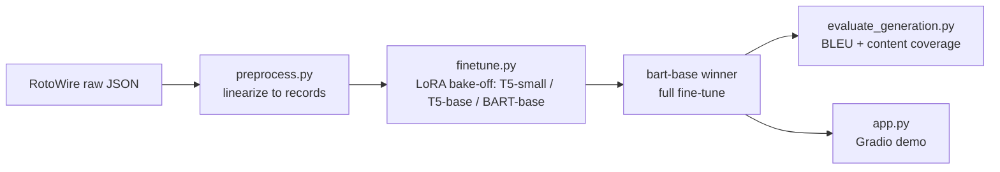

# NBA Box-Score → Recap Generator

Fine-tunes `facebook/bart-base` with LoRA to turn a structured NBA box score
into a natural-language game recap, on the [RotoWire](https://github.com/harvardnlp/boxscore-data)
dataset (Wiseman, Shieber & Rush, EMNLP 2017).

**Try it live:** [Hugging Face Space demo](https://huggingface.co/spaces/antoineboubouu/rotowire-recap-demo) · [model on the Hub](https://huggingface.co/antoineboubouu/bart-base-rotowire-recap)

## Results

Full fine-tune on 3,398 training games, evaluated on the 728-game test set:

| Model | BLEU |
|---|---|
| Template baseline (Wiseman et al., 2017) | 6.78 |
| **This project (BART-base + LoRA)** | **9.56** |
| Joint Copy (Wiseman et al., 2017) | 12.96 |
| Conditional Copy — best in paper (Wiseman et al., 2017) | 14.49 |

Above the naive baseline, below the paper's dedicated copy-mechanism models —
expected, since BART-base here has no explicit copy mechanism for numeric
values and sees a compressed box score (3 players/team × 6 stats, needed to
fit the 1024-token input limit). See "Known limitations" below.

## Pipeline



- **`preprocess.py`** — linearizes each game into `<record> entity | stat | value | HOME|VIS </record>` spans: top-3 players/team by minutes played × 6 stats (MIN/PTS/REB/AST/STL/BLK), tuned to keep the median input under BART's 1024-token limit.
- **`finetune.py`** — LoRA fine-tuning (T5-small/base, BART-base bake-off on a subset, then a full run on the winner), with early stopping and gradient accumulation for the heavier candidate.
- **`predict.py` / `evaluate_generation.py`** — batch generation + BLEU and an approximate content-coverage score (explicitly *not* the paper's RG/CS/CO metrics — see the module docstring for why).
- **`app.py`** — Gradio demo: pick a held-out test game, see a rendered box score, generate one or more sampled recaps, compare to the real human summary.

## Quickstart

```bash
pip install -r requirements.txt

# 1. Download RotoWire (see link above) into data/raw/rotowire/, then:
python src/preprocess.py --raw-dir data/raw/rotowire --out-dir data/processed

# 2. Fine-tune (bake-off small candidates first, then full-train the winner)
python src/finetune.py --model facebook/bart-base \
    --train data/processed/train.jsonl --valid data/processed/valid.jsonl \
    --output models/bart-base-final --epochs 8 --early-stopping-patience 2 \
    --max-source-len 1024 --max-target-len 512

# 3. Evaluate
python src/predict.py --model-dir models/bart-base-final --input data/processed/test.jsonl --output data/processed/test_predictions.jsonl
python src/evaluate_generation.py --predictions data/processed/test_predictions.jsonl

# 4. Demo
python src/app.py --model-dir models/bart-base-final --test data/processed/test.jsonl
```

## Known limitations

- **Compressed input** (3 players/team, 6 stats) trades recall for token budget — a bench player who mattered can be left out entirely.
- **No copy mechanism** — BART-base regenerates every number from its vocabulary rather than copying it from the box score, unlike the paper's best models.
- **RG/CS/CO not implemented** — the paper's real content-selection metrics need a separate information-extraction model; the "content coverage" number here is a coarser proxy (see `evaluate_generation.py`).
- **Dataset stops in March 2017.** Extending to live/recent games via `nba_api` was investigated and shelved: `stats.nba.com` actively blocks requests from cloud/datacenter IPs (confirmed — not a one-off), and the free tier of the fallback (`balldontlie.io`) doesn't include per-player stats.

## Stack

Python · Hugging Face `transformers`/`datasets`/`peft` (LoRA) · Google Colab (T4 GPU) · Gradio · Hugging Face Spaces (ZeroGPU)
